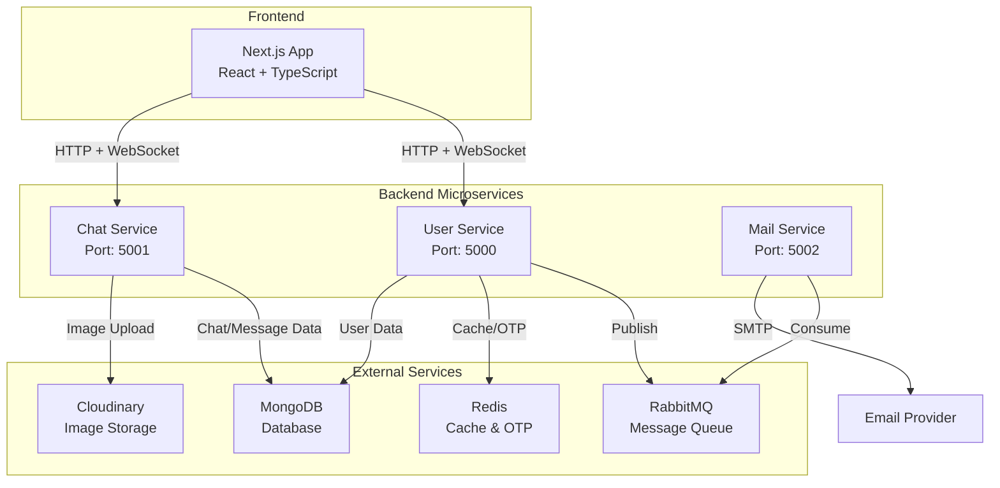
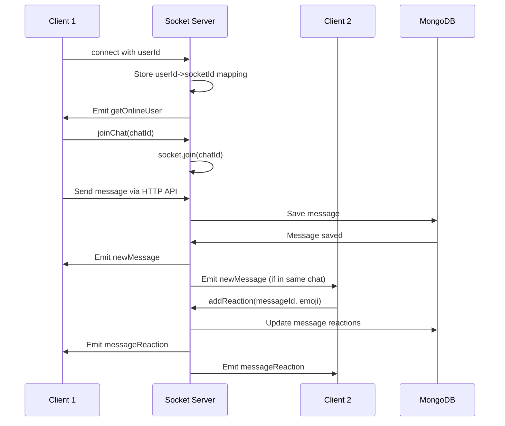
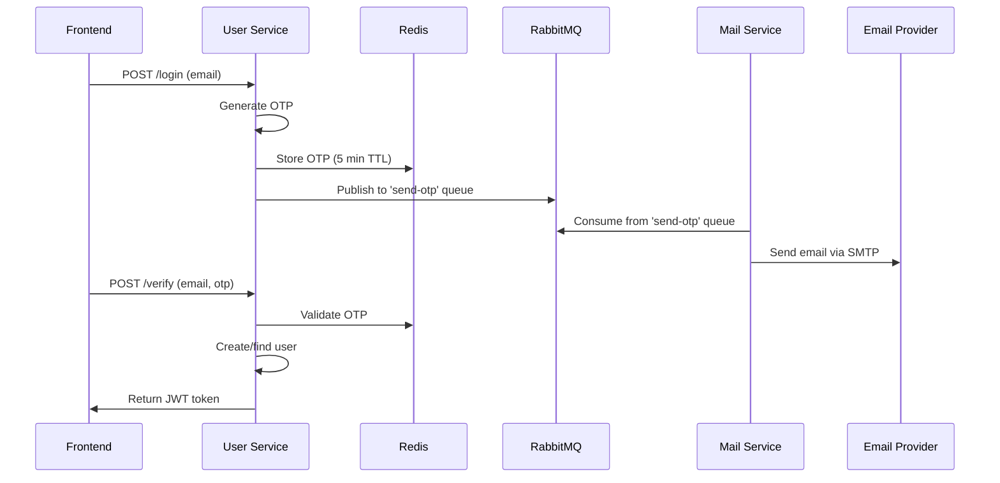
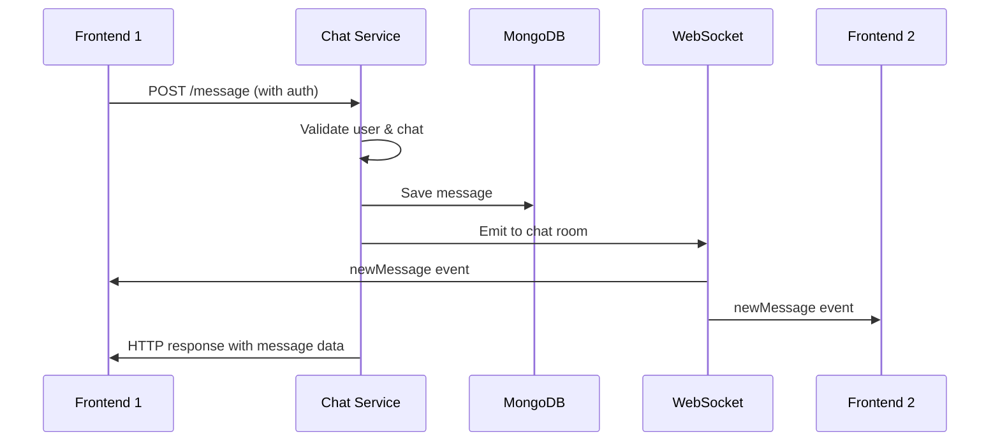
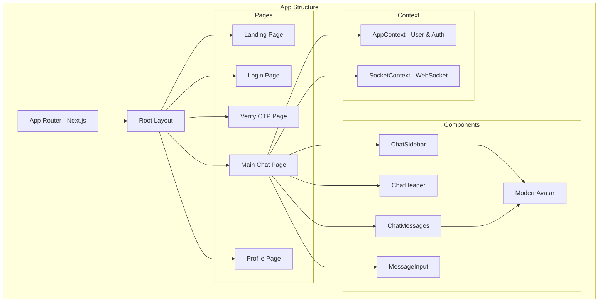
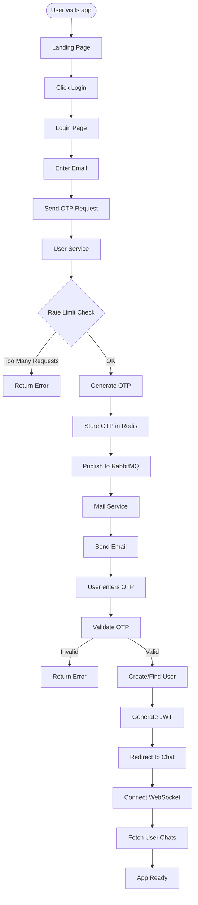
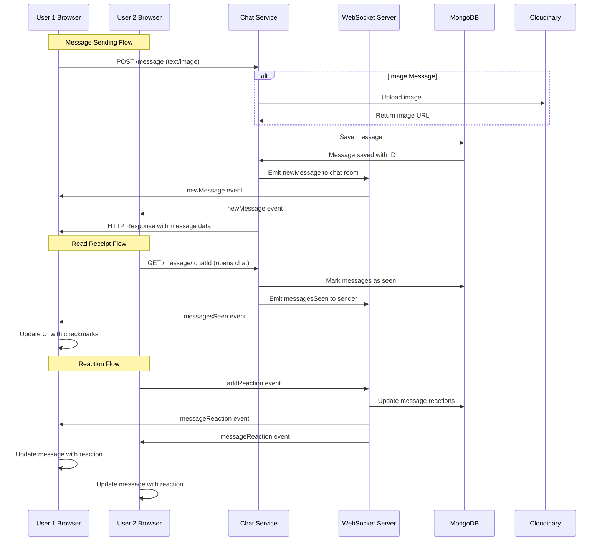
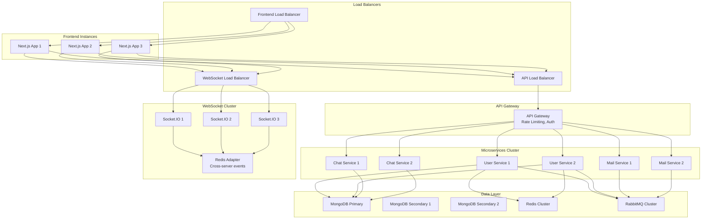
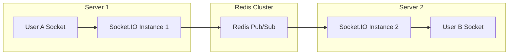

# **Complete Chat App Technical Guide - SDE Interview Preparation**

## **Table of Contents**
1. [Architecture Overview](#architecture-overview)
2. [Microservices Deep Dive](#microservices-deep-dive)
3. [Database Design & Schema](#database-design--schema)
4. [Real-time Communication (WebSockets)](#real-time-communication-websockets)
5. [Inter-Service Communication](#inter-service-communication)
6. [Frontend Architecture](#frontend-architecture)
7. [System Flow Diagrams](#system-flow-diagrams)
8. [Interview Questions & Answers](#interview-questions--answers)
9. [Scaling Considerations](#scaling-considerations)
10. [Trade-offs & Design Decisions](#trade-offs--design-decisions)

---

## **Architecture Overview**

### **System Architecture**



### **Tech Stack Summary**

**Frontend:**
- Next.js 15 (React 19, TypeScript)
- Tailwind CSS for styling
- Socket.IO Client for real-time communication
- Axios for HTTP requests
- Framer Motion for animations

**Backend:**
- Node.js with TypeScript
- Express.js framework
- Socket.IO for WebSockets
- Mongoose ODM
- JWT for authentication

**Infrastructure:**
- MongoDB (NoSQL Database)
- Redis (Caching & OTP storage)
- RabbitMQ (Message Queue)
- Cloudinary (Image CDN)

---

## **Microservices Deep Dive**

### **1. User Service (Port: 5000)**

**Responsibilities:**
- User authentication (OTP-based)
- User profile management
- JWT token generation
- OTP generation and validation

**Key Features:**
- OTP-based passwordless authentication
- Redis-based OTP storage and rate limiting
- Profile picture management
- Demo account support

**APIs:**
```javascript
POST /api/v1/login           // Send OTP to email
POST /api/v1/verify          // Verify OTP and get JWT
GET  /api/v1/me             // Get current user profile
PUT  /api/v1/profile        // Update profile
PUT  /api/v1/profile-pic    // Update profile picture
GET  /api/v1/users          // Get all users
GET  /api/v1/user/:id       // Get specific user
```

**Database Schema:**
```javascript
User: {
  _id: ObjectId,
  name: String,
  email: String (unique, required),
  profilePic: String (default: auto-generated avatar),
  createdAt: Date,
  updatedAt: Date
}
```

### **2. Chat Service (Port: 5001)**

**Responsibilities:**
- Real-time messaging via WebSocket
- Chat creation and management
- Message storage and retrieval
- File/image uploads
- Message reactions, replies, forwarding
- Read receipts and typing indicators

**Key Features:**
- Socket.IO for real-time communication
- Multi-media message support
- Message reactions system
- Reply/forward functionality
- Message deletion
- Auto-scroll and message pagination

**APIs:**
```javascript
POST /api/v1/chat/new              // Create new chat
GET  /api/v1/chat/all             // Get all user chats
POST /api/v1/message              // Send message (with file upload)
GET  /api/v1/message/:chatId      // Get chat messages
POST /api/v1/message/reaction     // Add/remove reaction
DELETE /api/v1/messages/:messageId // Delete message
GET  /api/v1/message/details/:messageId // Get message details
```

**WebSocket Events:**
```javascript
// Client to Server
'joinChat'      // Join chat room
'leaveChat'     // Leave chat room
'typing'        // User typing
'stopTyping'    // User stopped typing
'addReaction'   // Add message reaction

// Server to Client
'newMessage'        // New message received
'messagesSeen'      // Messages marked as seen
'messageDeleted'    // Message was deleted
'messageReaction'   // Reaction added/removed
'userTyping'        // User is typing
'userStoppedTyping' // User stopped typing
'getOnlineUser'     // Online users list
```

### **3. Mail Service (Port: 5002)**

**Responsibilities:**
- Email delivery for OTP
- Queue-based email processing
- SMTP integration

**Key Features:**
- RabbitMQ consumer for email queue
- Nodemailer SMTP integration
- Queue durability and message acknowledgment

**Queue Consumer:**
```javascript
Queue: 'send-otp'
Message Format: {
  to: string,
  subject: string,
  body: string
}
```

---

## **Database Design & Schema**

### **Why NoSQL (MongoDB)?**

**Advantages for Chat App:**
1. **Flexible Schema**: Messages can have varying structures (text, image, reply, etc.)
2. **Horizontal Scaling**: Easy to shard across multiple servers
3. **Document-based**: Natural fit for nested data (reactions, replies)
4. **Fast Writes**: Optimized for high-frequency message writes
5. **JSON-like Structure**: Direct mapping to JavaScript objects

### **Database Schemas**

#### **Users Collection**
```javascript
{
  _id: ObjectId("..."),
  name: "John Doe",
  email: "john@example.com",
  profilePic: "https://api.dicebear.com/7.x/identicon/svg?seed=randomseed",
  createdAt: ISODate("2024-01-01T00:00:00Z"),
  updatedAt: ISODate("2024-01-01T00:00:00Z")
}
```

#### **Chats Collection**
```javascript
{
  _id: ObjectId("..."),
  users: ["userId1", "userId2"],
  latestMessage: {
    text: "Hello there!",
    sender: "userId1"
  },
  createdAt: ISODate("2024-01-01T00:00:00Z"),
  updatedAt: ISODate("2024-01-01T12:00:00Z")
}
```

#### **Messages Collection**
```javascript
{
  _id: ObjectId("..."),
  chatId: ObjectId("..."),
  sender: "userId1",
  text: "Hello there!",
  image: {
    url: "https://cloudinary.com/...",
    publicId: "image_id"
  },
  messageType: "text", // text|image|deleted|reply|forward
  seen: true,
  seenAt: ISODate("2024-01-01T12:05:00Z"),
  reactions: [
    { userId: "userId2", emoji: "👍" }
  ],
  replyTo: ObjectId("..."), // Reference to replied message
  repliedMessage: {
    _id: ObjectId("..."),
    text: "Original message",
    sender: "userId2",
    messageType: "text"
  },
  forwardedFrom: "Original Sender Name",
  createdAt: ISODate("2024-01-01T12:00:00Z"),
  updatedAt: ISODate("2024-01-01T12:05:00Z")
}
```

### **SQL Schema Conversion**

**If converting to SQL, here's the schema design:**

```sql
-- Users Table
CREATE TABLE users (
    id BIGINT PRIMARY KEY AUTO_INCREMENT,
    name VARCHAR(255) NOT NULL,
    email VARCHAR(255) UNIQUE NOT NULL,
    profile_pic TEXT,
    created_at TIMESTAMP DEFAULT CURRENT_TIMESTAMP,
    updated_at TIMESTAMP DEFAULT CURRENT_TIMESTAMP ON UPDATE CURRENT_TIMESTAMP
);

-- Chats Table
CREATE TABLE chats (
    id BIGINT PRIMARY KEY AUTO_INCREMENT,
    created_at TIMESTAMP DEFAULT CURRENT_TIMESTAMP,
    updated_at TIMESTAMP DEFAULT CURRENT_TIMESTAMP ON UPDATE CURRENT_TIMESTAMP
);

-- Chat Participants (Many-to-Many)
CREATE TABLE chat_participants (
    chat_id BIGINT REFERENCES chats(id),
    user_id BIGINT REFERENCES users(id),
    joined_at TIMESTAMP DEFAULT CURRENT_TIMESTAMP,
    PRIMARY KEY (chat_id, user_id)
);

-- Messages Table
CREATE TABLE messages (
    id BIGINT PRIMARY KEY AUTO_INCREMENT,
    chat_id BIGINT REFERENCES chats(id),
    sender_id BIGINT REFERENCES users(id),
    text TEXT,
    message_type ENUM('text', 'image', 'deleted', 'reply', 'forward'),
    image_url TEXT,
    image_public_id VARCHAR(255),
    reply_to_id BIGINT REFERENCES messages(id),
    forwarded_from VARCHAR(255),
    seen BOOLEAN DEFAULT FALSE,
    seen_at TIMESTAMP NULL,
    created_at TIMESTAMP DEFAULT CURRENT_TIMESTAMP,
    updated_at TIMESTAMP DEFAULT CURRENT_TIMESTAMP ON UPDATE CURRENT_TIMESTAMP,
    INDEX idx_chat_created (chat_id, created_at),
    INDEX idx_sender (sender_id)
);

-- Message Reactions
CREATE TABLE message_reactions (
    message_id BIGINT REFERENCES messages(id),
    user_id BIGINT REFERENCES users(id),
    emoji VARCHAR(10) NOT NULL,
    created_at TIMESTAMP DEFAULT CURRENT_TIMESTAMP,
    PRIMARY KEY (message_id, user_id),
    UNIQUE KEY unique_user_reaction (message_id, user_id)
);
```

**SQL vs NoSQL Trade-offs:**

| Aspect | NoSQL (MongoDB) | SQL (PostgreSQL/MySQL) |
|--------|-----------------|------------------------|
| Schema Flexibility | ✅ High | ❌ Rigid |
| Complex Queries | ❌ Limited | ✅ Excellent |
| Horizontal Scaling | ✅ Easy | ❌ Complex |
| ACID Transactions | ❌ Limited | ✅ Full Support |
| Learning Curve | ✅ Easy | ❌ Steeper |
| Data Consistency | ❌ Eventual | ✅ Strong |
| JSON Handling | ✅ Native | ❌ Additional overhead |

---

## **Real-time Communication (WebSockets)**

### **WebSocket Architecture**



### **WebSocket Connection Management**

**Connection Flow:**
1. **Authentication**: User connects with JWT userId in query params
2. **Mapping**: Server maps userId to socketId
3. **Room Management**: Users join/leave chat-specific rooms
4. **Online Status**: Broadcasting online users list

**Key Implementation Details:**

```javascript
// Socket Connection Setup
const userSocketMap: Record<string, string> = {};

io.on("connection", (socket: Socket) => {
  const userId = socket.handshake.query.userId as string;
  
  if (userId && userId !== "undefined") {
    userSocketMap[userId] = socket.id;
    io.emit("getOnlineUser", Object.keys(userSocketMap));
  }
  
  // Join user to their own room for direct messaging
  socket.join(userId);
});
```

**Message Delivery Logic:**
1. **Same Chat Room**: Instant delivery via socket rooms
2. **Direct User Messaging**: Via user-specific socket rooms
3. **Message Persistence**: All messages saved to DB regardless of delivery
4. **Read Receipts**: Automatic when user is in active chat room

### **Real-time Features Implementation**

#### **1. Typing Indicators**
```javascript
// Client emits typing
socket.emit("typing", { chatId, userId });

// Server broadcasts to chat room (excluding sender)
socket.to(chatId).emit("userTyping", { chatId, userId });

// Auto-stop after 2 seconds of inactivity
setTimeout(() => {
  socket.emit("stopTyping", { chatId, userId });
}, 2000);
```

#### **2. Message Reactions**
```javascript
// Real-time reaction handling
socket.on("addReaction", async (data) => {
  const { messageId, emoji } = data;
  
  // Update database
  const message = await Messages.findById(messageId);
  // ... reaction logic
  
  // Broadcast to all chat participants
  io.to(chatId).emit("messageReaction", {
    messageId,
    reactions: newReactions
  });
});
```

#### **3. Read Receipts**
```javascript
// Auto-mark as seen when user opens chat
const isReceiverInChatRoom = receiverSocket.rooms.has(chatId);

// Set seen status based on active chat room
messageData.seen = isReceiverInChatRoom;
messageData.seenAt = isReceiverInChatRoom ? new Date() : undefined;
```

---

## **Inter-Service Communication**

### **Communication Patterns**

#### **1. HTTP API Calls (Synchronous)**
- **Chat Service → User Service**: Fetch user details for chat display
- **Frontend → All Services**: REST API requests

```javascript
// Chat service fetching user data
const { data } = await axios.get(
  `${process.env.USER_SERVICE}/api/v1/user/${otherUserId}`
);
```

#### **2. Message Queues (Asynchronous)**
- **User Service → Mail Service**: OTP email delivery

```javascript
// Publisher (User Service)
await publishToQueue("send-otp", {
  to: email,
  subject: "Your OTP code",
  body: `Your OTP is ${otp}`
});

// Consumer (Mail Service)
channel.consume("send-otp", async (msg) => {
  const { to, subject, body } = JSON.parse(msg.content.toString());
  await transporter.sendMail({ from, to, subject, text: body });
  channel.ack(msg);
});
```

### **Service Discovery & Configuration**

**Environment Variables:**
```bash
# User Service
PORT=5000
MONGO_URL=mongodb://localhost:27017/chatapp-users
REDIS_URL=redis://localhost:6379
CLOUDAMQP_URL=amqp://localhost:5672
JWT_SECRET=your_jwt_secret

# Chat Service  
PORT=5001
MONGO_URL=mongodb://localhost:27017/chatapp-chats
USER_SERVICE=http://localhost:5000
CLOUDINARY_CLOUD_NAME=your_cloud_name
CLOUDINARY_API_KEY=your_api_key

# Mail Service
PORT=5002
CLOUDAMQP_URL=amqp://localhost:5672
EMAIL_USER=your_email@gmail.com
EMAIL_PASSWORD=your_app_password
```

### **Data Flow Patterns**

#### **User Registration Flow**


#### **Message Sending Flow**


---

## **Frontend Architecture**

### **Component Structure**



### **State Management**

#### **AppContext (Global State)**
```javascript
interface AppContextType {
  loading: boolean;
  isAuth: boolean;
  user: User | null;
  users: User[];
  chats: ChatWithUser[] | null;
  fetchChats: () => Promise<void>;
  setChats: (chats: ChatWithUser[]) => void;
  loginUser: (userData: any) => void;
  logoutUser: () => void;
}
```

#### **SocketContext (WebSocket Management)**
```javascript
interface SocketContextType {
  socket: Socket | null;
  onlineUsers: string[];
}
```

### **Frontend-Backend Integration**

#### **API Communication Patterns**

**1. Authentication Flow:**
```javascript
// Login request
const response = await axios.post(`${user_service}/api/v1/login`, { email });

// JWT token usage
const config = {
  headers: { Authorization: `Bearer ${token}` }
};
```

**2. Real-time Message Handling:**
```javascript
useEffect(() => {
  socket?.on("newMessage", (message) => {
    if (selectedUser === message.chatId) {
      setMessages(prev => [...(prev || []), message]);
    }
    moveChatToTop(message.chatId, message);
  });

  socket?.on("messageReaction", (data) => {
    setMessages(prev => 
      prev?.map(msg => 
        msg._id === data.messageId 
          ? { ...msg, reactions: data.reactions }
          : msg
      )
    );
  });
}, [socket, selectedUser]);
```

**3. File Upload Handling:**
```javascript
const handleMessageSend = async (e, imageFile, replyTo) => {
  const formData = new FormData();
  formData.append("chatId", selectedUser);
  if (message.trim()) formData.append("text", message);
  if (imageFile) formData.append("image", imageFile);
  if (replyTo) formData.append("replyTo", replyTo);

  const { data } = await axios.post(
    `${chat_service}/api/v1/message`, 
    formData,
    {
      headers: {
        Authorization: `Bearer ${token}`,
        "Content-Type": "multipart/form-data"
      }
    }
  );
};
```

### **Search Functionality Deep Dive**

#### **Frontend Search Implementation**
```javascript
const handleSearch = (query: string) => {
  if (!query.trim()) {
    setFilteredMessages(null);
    return;
  }

  const filtered = messages.filter((message) => {
    // Skip deleted messages
    if (message.messageType === "deleted") return false;
    
    // Search in message text
    if (message.text?.toLowerCase().includes(query.toLowerCase())) {
      return true;
    }
    
    // Search in replied message text
    if (message.repliedMessage?.text?.toLowerCase().includes(query.toLowerCase())) {
      return true;
    }
    
    return false;
  });
  
  setFilteredMessages(filtered);
};
```

#### **Search Highlighting**
```javascript
const highlightSearchTerm = (text: string, searchTerm: string) => {
  if (!searchTerm || !text) return text;
  
  const regex = new RegExp(
    `(${searchTerm.replace(/[.*+?^${}()|[\]\\]/g, '\\$&')})`, 
    'gi'
  );
  const parts = text.split(regex);
  
  return parts.map((part, index) => {
    if (regex.test(part)) {
      return (
        <span key={index} className="bg-yellow-500/30 text-yellow-200 px-1 rounded">
          {part}
        </span>
      );
    }
    return part;
  });
};
```

---

## **System Flow Diagrams**

### **Complete User Journey Flow**



### **Message Flow Architecture**



### **Scaling Architecture**



---

## **Interview Questions & Answers**

### **Architecture & Design Questions**

#### **Q1: Why did you choose a microservices architecture over a monolith?**

**Answer:**
"I chose microservices for this chat application for several key reasons:

1. **Separation of Concerns**: Each service has a single responsibility - User service handles authentication, Chat service manages messaging, and Mail service handles email delivery.

2. **Independent Scaling**: Chat service can be scaled independently since it handles the most load, while mail service might need fewer instances.

3. **Technology Flexibility**: Could use different databases or technologies per service if needed (e.g., Redis for user service caching, MongoDB for chat storage).

4. **Fault Isolation**: If the mail service goes down, users can still chat and authenticate.

5. **Team Independence**: Different teams could work on different services without blocking each other.

**Trade-offs considered:**
- **Complexity**: Added network overhead and distributed system complexity
- **Latency**: Cross-service calls add latency (mitigated with async messaging where possible)
- **Data Consistency**: Had to design around eventual consistency instead of ACID transactions

**Real-world example**: If this were a monolith and the email sending logic had a memory leak, it would crash the entire application, taking down chat functionality too. With microservices, only OTP emails would be affected."

#### **Q2: Why did you choose NoSQL (MongoDB) over SQL databases?**

**Answer:**
"I chose MongoDB for several reasons specific to chat applications:

**Advantages:**
1. **Schema Flexibility**: Messages have varying structures - text messages, image messages, replies with nested content. NoSQL handles this naturally without complex JOINs.

2. **Document-based Storage**: A message with reactions, replies, and metadata fits naturally in a single document, avoiding multiple table JOINs.

3. **Horizontal Scaling**: Chat apps need to scale writes heavily. MongoDB's sharding is easier than SQL partitioning.

4. **JSON-Native**: Direct mapping between database documents and JavaScript objects, reducing impedance mismatch.

**SQL Alternative & Trade-offs:**
If I had to use SQL, I'd structure it like this:
```sql
-- Messages table with JSON columns for flexibility
CREATE TABLE messages (
    id BIGINT PRIMARY KEY,
    chat_id BIGINT,
    sender_id BIGINT,
    content JSONB, -- Contains text, type, reply data
    reactions JSONB, -- Array of reactions
    created_at TIMESTAMP
);
```

**SQL would give me:**
- ✅ Better complex queries and analytics
- ✅ ACID transactions for consistency
- ✅ More mature ecosystem

**But I'd lose:**
- ❌ Schema flexibility for evolving message types
- ❌ Easy horizontal scaling
- ❌ Simple document operations

**Real-world consideration**: For a chat app prioritizing rapid development and horizontal scaling over complex analytics, NoSQL was the right choice."

#### **Q3: How do you handle real-time communication and why WebSockets over alternatives?**

**Answer:**
"I implemented real-time communication using Socket.IO (WebSocket-based) for several reasons:

**Why WebSockets over alternatives:**

1. **HTTP Polling** (Alternative):
   - ❌ Inefficient: Constant requests even when no new messages
   - ❌ Higher latency: Messages delayed by polling interval
   - ❌ Server load: Unnecessary requests consume resources

2. **Server-Sent Events** (Alternative):
   - ❌ Unidirectional: Only server-to-client, need HTTP for client actions
   - ❌ No binary data: Can't efficiently send images
   - ❌ Connection limits: Browser limits concurrent SSE connections

3. **WebSockets** (My Choice):
   - ✅ Bidirectional: Real-time typing indicators, reactions
   - ✅ Low latency: Instant message delivery
   - ✅ Efficient: Single persistent connection
   - ✅ Binary support: Future-proof for file sharing

**Implementation Details:**

```javascript
// Connection management
const userSocketMap: Record<string, string> = {};

// Room-based messaging for efficiency  
socket.join(chatId); // Only chat participants get messages

// Multiple delivery guarantees
io.to(chatId).emit('newMessage', message);      // Room broadcast
io.to(receiverSocketId).emit('newMessage', message); // Direct delivery
```

**Real-world scenarios:**
- **Typing indicators**: Immediate feedback without API calls
- **Read receipts**: Instant when user opens chat
- **Reactions**: Sub-second propagation to all chat participants
- **Online status**: Live presence indicators

**Fallback handling**: Messages are always persisted to database, so if WebSocket fails, users get messages on page refresh via HTTP API."

#### **Q4: How would you convert this to a monolithic architecture and what would change?**

**Answer:**
"Converting to a monolith would involve consolidating all services into a single application:

**Monolithic Structure:**
```
src/
├── controllers/
│   ├── userController.ts    // All user operations
│   ├── chatController.ts    // All chat operations  
│   └── mailController.ts    // Email operations
├── models/
│   ├── User.ts
│   ├── Chat.ts
│   └── Message.ts
├── services/
│   ├── authService.ts       // JWT, OTP logic
│   ├── emailService.ts      // Direct SMTP
│   └── socketService.ts     // WebSocket handling
├── routes/
│   ├── userRoutes.ts
│   ├── chatRoutes.ts
└── app.ts                   // Single Express app
```

**Key Changes:**

1. **Remove RabbitMQ**: Direct function calls instead of message queues
```javascript
// Instead of publishing to queue
await publishToQueue('send-otp', emailData);

// Direct service call
await emailService.sendOTP(emailData);
```

2. **Unified Database Connection**: Single MongoDB connection shared across all features
```javascript
// Single database connection
const mongoConnection = mongoose.connect(MONGO_URL);
```

3. **In-Memory State**: No need for Redis adapter for WebSocket scaling (single instance)
```javascript
const userSocketMap = new Map(); // In-memory instead of Redis
```

4. **Simplified Deployment**: Single container/process instead of 3 separate services

**Real-world implications:**

**Benefits:**
- ✅ **Simpler deployment**: One build, one deploy
- ✅ **Easier debugging**: Single codebase, unified logging  
- ✅ **Better performance**: No network overhead between services
- ✅ **ACID transactions**: Can use database transactions across all operations

**Drawbacks:**
- ❌ **Single point of failure**: Email issues crash entire app
- ❌ **Scaling limitations**: Must scale entire app even if only chat needs more resources
- ❌ **Team bottlenecks**: All developers work in same codebase
- ❌ **Technology lock-in**: Harder to adopt new technologies for specific features

**When I'd choose monolith:**
- Small team (1-3 developers)
- Simple deployment requirements
- Limited scalability needs (<10k concurrent users)
- Strong consistency requirements across all features

**Example scenario**: If this chat app needed financial transactions (premium features), the ACID transaction support in a monolith would be valuable for ensuring payment and feature activation happen atomically."

### **Database & Schema Questions**

#### **Q5: How do you handle message ordering and consistency in a distributed system?**

**Answer:**
"Message ordering is crucial for chat applications. Here's my approach:

**Current Implementation:**
1. **MongoDB ObjectId Ordering**: ObjectIds contain timestamps, providing natural chronological ordering
```javascript
// Messages sorted by creation time (embedded in _id)
const messages = await Messages.find({ chatId })
  .sort({ createdAt: 1 }); // Explicit timestamp sorting
```

2. **Single Chat Service**: All messages for a chat go through the same service instance, maintaining order within a chat

3. **Database-level Ordering**: MongoDB's single-document ACID properties ensure consistent message insertion

**Challenges in Scale:**

**Problem**: Multiple chat service instances could create race conditions:
```
Time: T1        T2        T3
User A: ----[Send Msg1]---------> Service Instance 1
User B: ----------[Send Msg2]--> Service Instance 2  
DB:     Msg2 saved    Msg1 saved (wrong order!)
```

**Solution Approaches:**

1. **Chat-Level Sharding**:
```javascript
// Route messages to same service instance per chat
const serviceInstance = chatId % numberOfInstances;
```

2. **Database Sequence Numbers**:
```javascript
const messageSchema = {
  chatId: ObjectId,
  sequenceNumber: Number, // Auto-increment per chat
  timestamp: Date,
  // ... other fields
}

// Compound index for ordering
db.messages.createIndex({ chatId: 1, sequenceNumber: 1 });
```

3. **Event Sourcing Pattern**:
```javascript
// Store message events in order
const event = {
  eventType: 'MessageSent',
  chatId,
  eventSequence: await getNextSequence(chatId),
  payload: messageData,
  timestamp: new Date()
};
```

**WebSocket Consistency:**
```javascript
// Ensure UI updates match database order
socket.on('newMessage', (message) => {
  setMessages(prev => {
    const updated = [...prev, message];
    // Re-sort by timestamp to handle out-of-order delivery
    return updated.sort((a, b) => 
      new Date(a.createdAt) - new Date(b.createdAt)
    );
  });
});
```

**Real-world example**: WhatsApp shows messages with timestamp but occasionally you'll see a slight reordering when messages arrive out of sequence - they handle this with sequence numbers and client-side reordering."

#### **Q6: How would you implement message search at scale?**

**Answer:**
"My current implementation is client-side filtering, which works for small chats but doesn't scale. Here's how I'd implement it at scale:

**Current Limitation:**
```javascript
// Client-side filtering - doesn't scale
const filtered = messages.filter(message => 
  message.text.toLowerCase().includes(query.toLowerCase())
);
```

**Scalable Solutions:**

**1. Full-Text Search with MongoDB Atlas Search:**
```javascript
// Create search index
{
  "mappings": {
    "dynamic": false,
    "fields": {
      "text": {
        "type": "string",
        "analyzer": "lucene.standard"
      },
      "sender": { "type": "string" },
      "chatId": { "type": "objectId" }
    }
  }
}

// Search query
const searchResults = await Messages.aggregate([
  {
    $search: {
      "text": {
        "query": searchTerm,
        "path": "text"
      }
    }
  },
  { $match: { chatId: ObjectId(chatId) } },
  { $limit: 50 }
]);
```

**2. Elasticsearch Integration:**
```javascript
// Index messages in Elasticsearch
const indexMessage = async (message) => {
  await elasticClient.index({
    index: 'messages',
    id: message._id,
    body: {
      text: message.text,
      chatId: message.chatId,
      sender: message.sender,
      timestamp: message.createdAt,
      participants: await getChatParticipants(message.chatId)
    }
  });
};

// Search implementation
const searchMessages = async (userId, query, chatId = null) => {
  const searchBody = {
    query: {
      bool: {
        must: [
          { match: { text: query } },
          { terms: { participants: [userId] } } // Security filter
        ],
        ...(chatId && { filter: [{ term: { chatId } }] })
      }
    },
    highlight: {
      fields: {
        text: {}
      }
    },
    size: 50
  };

  return await elasticClient.search({
    index: 'messages',
    body: searchBody
  });
};
```

**3. Hybrid Approach (Production-Ready):**

```javascript
// API endpoint for search
app.get('/api/v1/search', isAuth, async (req, res) => {
  const { query, chatId, page = 1, limit = 20 } = req.query;
  const userId = req.user._id;

  // Security: Only search in user's chats
  const userChats = await Chat.find({ users: userId }).select('_id');
  const chatIds = userChats.map(chat => chat._id);

  let searchFilter = { 
    chatId: { $in: chatIds },
    messageType: { $ne: 'deleted' },
    $text: { $search: query }
  };

  if (chatId) {
    searchFilter.chatId = ObjectId(chatId);
  }

  const results = await Messages.find(searchFilter)
    .populate('chatId', 'users')
    .sort({ score: { $meta: 'textScore' } })
    .skip((page - 1) * limit)
    .limit(limit);

  res.json({
    results: results.map(msg => ({
      ...msg.toObject(),
      highlighted: highlightSearchTerm(msg.text, query)
    })),
    totalCount: await Messages.countDocuments(searchFilter)
  });
});
```

**Performance Optimizations:**

1. **Indexing Strategy:**
```javascript
// Compound text index for better performance
db.messages.createIndex({
  "chatId": 1,
  "text": "text",
  "createdAt": -1
});
```

2. **Caching:**
```javascript
// Redis cache for popular searches
const cacheKey = `search:${userId}:${query}:${chatId || 'all'}`;
const cached = await redis.get(cacheKey);
if (cached) return JSON.parse(cached);
```

3. **Search Analytics:**
```javascript
// Track search patterns for optimization
await redis.zadd('popular_searches', Date.now(), query);
```

**Real-world considerations:**
- **Privacy**: Ensure users can only search their own chats
- **Relevance**: Weight recent messages higher
- **Performance**: Limit search to last N months of messages
- **Language**: Support different languages and emoji search

**Alternative for very large scale**: Use purpose-built search services like Algolia or AWS CloudSearch for advanced features like typo tolerance and instant search."

### **WebSocket & Real-time Questions**

#### **Q7: How do you handle WebSocket scaling across multiple server instances?**

**Answer:**
"WebSocket scaling is challenging because connections are stateful and tied to specific server instances. Here's my approach:

**Current Limitation (Single Instance):**
```javascript
// Works only on single server
const userSocketMap: Record<string, string> = {};
io.to(receiverSocketId).emit('newMessage', message);
```

**Production Scaling Solutions:**

**1. Redis Adapter for Socket.IO:**
```javascript
import { createAdapter } from '@socket.io/redis-adapter';
import { createClient } from 'redis';

const pubClient = createClient({ host: 'redis-server' });
const subClient = pubClient.duplicate();

io.adapter(createAdapter(pubClient, subClient));

// Now events work across multiple instances
io.to(chatId).emit('newMessage', message);
```

**How it works:**


**2. Sticky Sessions (Load Balancer):**
```nginx
# Nginx configuration
upstream socketio_backend {
    ip_hash; # Route same IP to same server
    server socket1.example.com:3000;
    server socket2.example.com:3000;
    server socket3.example.com:3000;
}
```

**3. Message Queue Integration:**
```javascript
// Instead of direct socket emission
const emitToUser = async (userId: string, event: string, data: any) => {
  // Try local connection first
  const localSocket = getLocalSocket(userId);
  if (localSocket) {
    localSocket.emit(event, data);
    return;
  }
  
  // Publish to message queue for other instances
  await redis.publish('socket_events', JSON.stringify({
    userId,
    event,
    data
  }));
};

// Subscribe to events from other instances  
redis.subscribe('socket_events', (message) => {
  const { userId, event, data } = JSON.parse(message);
  const localSocket = getLocalSocket(userId);
  if (localSocket) {
    localSocket.emit(event, data);
  }
});
```

**4. Database-Backed Session Store:**
```javascript
// Store active connections in database
interface ActiveConnection {
  userId: string;
  socketId: string;
  serverId: string;
  lastSeen: Date;
}

// When user connects
await ActiveConnections.upsert({
  userId,
  socketId: socket.id,
  serverId: process.env.SERVER_ID,
  lastSeen: new Date()
});

// To send message to user
const sendMessageToUser = async (userId: string, data: any) => {
  const connection = await ActiveConnections.findOne({ userId });
  
  if (connection.serverId === process.env.SERVER_ID) {
    // Local connection
    io.to(connection.socketId).emit('newMessage', data);
  } else {
    // Remote connection - use message queue
    await publishToServer(connection.serverId, {
      socketId: connection.socketId,
      event: 'newMessage',
      data
    });
  }
};
```

**Advanced: Room Management Across Instances:**
```javascript
// Redis-backed room membership
const joinChatRoom = async (chatId: string, userId: string) => {
  // Local socket operations
  socket.join(chatId);
  
  // Global room membership tracking
  await redis.sadd(`chat_room:${chatId}`, userId);
  await redis.setex(`user_location:${userId}`, 3600, process.env.SERVER_ID);
};

const broadcastToChatRoom = async (chatId: string, event: string, data: any) => {
  // Get all users in chat room
  const roomMembers = await redis.smembers(`chat_room:${chatId}`);
  
  // Group by server for efficient broadcasting
  const serverGroups = {};
  for (const userId of roomMembers) {
    const serverId = await redis.get(`user_location:${userId}`);
    if (!serverGroups[serverId]) serverGroups[serverId] = [];
    serverGroups[serverId].push(userId);
  }
  
  // Broadcast to each server
  for (const [serverId, users] of Object.entries(serverGroups)) {
    if (serverId === process.env.SERVER_ID) {
      // Local broadcast
      users.forEach(userId => {
        const socketId = getUserSocketId(userId);
        if (socketId) io.to(socketId).emit(event, data);
      });
    } else {
      // Remote broadcast
      await publishToServer(serverId, { users, event, data });
    }
  }
};
```

**Connection Recovery:**
```javascript
// Handle reconnections gracefully
socket.on('disconnect', async (reason) => {
  if (reason === 'io server disconnect') {
    // Server-initiated disconnect, client will auto-reconnect
    return;
  }
  
  // Clean up user presence
  await redis.srem(`online_users`, userId);
  await redis.del(`user_location:${userId}`);
});

// Client-side reconnection logic
socket.on('connect', () => {
  // Rejoin all active chat rooms
  activeChats.forEach(chatId => {
    socket.emit('joinChat', chatId);
  });
});
```

**Real-world considerations:**
- **Cost**: Redis adapter adds infrastructure cost but necessary for scale
- **Latency**: Cross-server events add ~10-50ms latency
- **Complexity**: More failure points to monitor and handle
- **Alternative**: Use managed services like AWS API Gateway WebSockets or Pusher for simpler scaling

**When to scale**: Start with single instance until you hit ~10k concurrent connections, then implement Redis adapter."

#### **Q8: How do you ensure message delivery guarantees?**

**Answer:**
"Message delivery in real-time systems is complex. Here's my approach with different guarantee levels:

**Current Implementation (At-Most-Once):**
```javascript
// Simple socket emission - no delivery guarantee
io.to(receiverSocketId).emit('newMessage', message);
```

**Problem**: If user is offline or WebSocket fails, message is lost from real-time perspective.

**Enhanced Delivery Guarantees:**

**1. At-Least-Once Delivery with Acknowledgments:**
```javascript
// Server-side with acknowledgment
socket.emit('newMessage', message, (ack) => {
  if (ack === 'received') {
    console.log('Message delivered successfully');
  } else {
    // Retry logic or store for later delivery
    scheduleRetry(message, receiverSocketId);
  }
});

// Client-side acknowledgment
socket.on('newMessage', (message, callback) => {
  // Process message
  addMessageToUI(message);
  
  // Acknowledge receipt
  callback('received');
});
```

**2. Persistent Delivery Queue:**
```javascript
interface PendingMessage {
  _id: ObjectId;
  receiverUserId: string;
  event: string;
  data: any;
  attempts: number;
  nextRetryAt: Date;
  createdAt: Date;
}

// Store message for offline users
const sendMessageWithGuarantee = async (receiverUserId: string, data: any) => {
  const receiverSocket = getRecieverSocketId(receiverUserId);
  
  if (receiverSocket && isSocketConnected(receiverSocket)) {
    // Direct delivery for online users
    socket.to(receiverSocket).emit('newMessage', data, (ack) => {
      if (!ack) {
        // Store for retry if no acknowledgment
        savePendingMessage(receiverUserId, 'newMessage', data);
      }
    });
  } else {
    // Store for offline users
    await savePendingMessage(receiverUserId, 'newMessage', data);
  }
};

// Deliver pending messages on connection
socket.on('connection', async (socket) => {
  const userId = socket.handshake.query.userId;
  
  // Deliver pending messages
  const pending = await PendingMessages.find({ 
    receiverUserId: userId 
  }).sort({ createdAt: 1 });
  
  for (const msg of pending) {
    socket.emit(msg.event, msg.data, async (ack) => {
      if (ack === 'received') {
        await PendingMessages.deleteOne({ _id: msg._id });
      }
    });
  }
});
```

**3. Message Sequence Numbers:**
```javascript
// Ensure ordered delivery
interface MessageWithSequence {
  messageId: string;
  sequenceNumber: number;
  chatId: string;
  data: any;
}

// Client-side sequence tracking
const expectedSequence = new Map<string, number>(); // chatId -> next expected sequence

socket.on('newMessage', (message: MessageWithSequence) => {
  const expected = expectedSequence.get(message.chatId) || 1;
  
  if (message.sequenceNumber === expected) {
    // In-order message
    processMessage(message);
    expectedSequence.set(message.chatId, expected + 1);
    
    // Process any queued out-of-order messages
    processQueuedMessages(message.chatId);
  } else if (message.sequenceNumber > expected) {
    // Out-of-order message - queue it
    queueMessage(message);
    
    // Request missing messages
    socket.emit('requestMissingMessages', {
      chatId: message.chatId,
      fromSequence: expected,
      toSequence: message.sequenceNumber - 1
    });
  }
  // Ignore duplicate messages (sequenceNumber < expected)
});
```

**4. Push Notifications Fallback:**
```javascript
const sendMessageWithFallback = async (receiverUserId: string, message: any) => {
  const delivered = await attemptSocketDelivery(receiverUserId, message);
  
  if (!delivered) {
    // Send push notification as fallback
    const user = await User.findById(receiverUserId);
    if (user.pushToken) {
      await sendPushNotification(user.pushToken, {
        title: 'New Message',
        body: message.text?.substring(0, 100) || 'You have a new message',
        data: { chatId: message.chatId }
      });
    }
    
    // Also send email for important messages
    if (message.priority === 'high') {
      await sendEmailNotification(user.email, message);
    }
  }
};
```

**5. Database as Source of Truth:**
```javascript
// Always persist first, then notify
const sendMessage = async (messageData: any) => {
  // 1. Save to database first (persistence guarantee)
  const savedMessage = await Messages.create(messageData);
  
  // 2. Attempt real-time delivery (best effort)
  try {
    await sendRealtimeMessage(savedMessage);
  } catch (error) {
    // Real-time delivery failed, but message is still saved
    console.warn('Real-time delivery failed:', error);
  }
  
  // 3. Client will get message via HTTP API on next load anyway
  return savedMessage;
};

// Client-side: Sync with database on reconnection
socket.on('connect', async () => {
  // Get latest messages from database to fill any gaps
  const lastMessageId = getLastMessageId();
  const { data } = await axios.get(
    `/api/v1/messages/since/${lastMessageId}`
  );
  
  // Merge with existing messages, avoiding duplicates
  mergeMessages(data.messages);
});
```

**6. Idempotency for Retry Safety:**
```javascript
// Client-side message deduplication
const processedMessages = new Set<string>();

socket.on('newMessage', (message) => {
  if (processedMessages.has(message._id)) {
    // Duplicate message from retry - ignore
    return;
  }
  
  processedMessages.add(message._id);
  addMessageToUI(message);
  
  // Clean up old message IDs periodically
  if (processedMessages.size > 10000) {
    cleanupOldMessageIds();
  }
});
```

**Delivery Guarantee Levels:**

| Level | Description | Use Case | Implementation Complexity |
|-------|-------------|----------|--------------------------|
| **At-Most-Once** | Message sent once, might be lost | Low importance notifications | ⭐ Simple |
| **At-Least-Once** | Message delivered, might duplicate | Important messages | ⭐⭐ Medium |
| **Exactly-Once** | Message delivered exactly once | Critical transactions | ⭐⭐⭐ Complex |

**Real-world example**: WhatsApp uses a combination:
- Real-time delivery for online users
- Push notifications for offline users  
- Database persistence as backup
- Message acknowledgment system (single/double checkmarks)
- Automatic retry with exponential backoff

**My recommendation**: Start with database persistence + best-effort real-time delivery, add acknowledgments and retry logic as the application scales."

### **Performance & Scaling Questions**

#### **Q9: How would you handle 1 million concurrent users?**

**Answer:**
"Scaling to 1 million concurrent users requires a complete architectural overhaul. Here's my approach:

**Current Bottlenecks:**
- Single MongoDB instance
- Single WebSocket server  
- In-memory user mapping
- No caching layer
- Synchronous inter-service calls

**Scaled Architecture:**

**1. Database Layer (Horizontal Scaling):**
```javascript
// MongoDB Sharding Strategy
// Shard by chatId to keep chat messages together
sh.shardCollection("chatapp.messages", { "chatId": 1 })

// Read Replicas for query scaling
const readDB = mongoose.createConnection(MONGO_READ_REPLICA_URL);
const writeDB = mongoose.createConnection(MONGO_PRIMARY_URL);

// Read/Write splitting
const getMessages = (chatId) => readDB.Messages.find({ chatId });
const saveMessage = (data) => writeDB.Messages.create(data);
```

**2. WebSocket Scaling (Multi-Instance with Redis):**
```javascript
// Horizontal WebSocket scaling
const cluster = require('cluster');
const numCPUs = require('os').cpus().length;

if (cluster.isMaster) {
  // Fork workers
  for (let i = 0; i < numCPUs; i++) {
    cluster.fork();
  }
} else {
  // Worker process with Socket.IO + Redis adapter
  const io = require('socket.io')(server);
  io.adapter(createRedisAdapter(redisClient));
}

// Load Balancer Configuration (HAProxy)
backend websocket_servers
    balance source  # Sticky sessions
    server ws1 10.0.1.10:3001 check
    server ws2 10.0.1.11:3001 check  
    server ws3 10.0.1.12:3001 check
    # ... up to 50+ instances
```

**3. Caching Strategy:**
```javascript
// Multi-layer caching
class MessageCache {
  constructor() {
    this.l1Cache = new Map(); // In-memory (100MB per instance)
    this.l2Cache = redis.createClient(); // Redis (10GB cluster)
  }
  
  async getMessage(messageId) {
    // L1: Memory cache (sub-millisecond)
    if (this.l1Cache.has(messageId)) {
      return this.l1Cache.get(messageId);
    }
    
    // L2: Redis cache (1-2ms)
    const cached = await this.l2Cache.get(`msg:${messageId}`);
    if (cached) {
      const message = JSON.parse(cached);
      this.l1Cache.set(messageId, message);
      return message;
    }
    
    // L3: Database (10-50ms)
    const message = await Messages.findById(messageId);
    if (message) {
      // Cache for future requests
      this.l2Cache.setex(`msg:${messageId}`, 3600, JSON.stringify(message));
      this.l1Cache.set(messageId, message);
    }
    return message;
  }
}

// Chat list caching (frequently accessed)
const getChatList = async (userId) => {
  const cacheKey = `chats:${userId}`;
  let chats = await redis.get(cacheKey);
  
  if (!chats) {
    chats = await Chat.find({ users: userId }).populate('latestMessage');
    await redis.setex(cacheKey, 300, JSON.stringify(chats)); // 5min TTL
  }
  
  return JSON.parse(chats);
};
```

**4. Database Sharding Strategy:**
```javascript
// Partition by user for even distribution
const getUserShard = (userId) => {
  const hash = crypto.createHash('md5').update(userId).digest('hex');
  return parseInt(hash.substring(0, 8), 16) % NUM_SHARDS;
};

// Cross-shard chat handling
const getCrossShardChat = async (user1Id, user2Id) => {
  const shard1 = getUserShard(user1Id);
  const shard2 = getUserShard(user2Id);
  
  if (shard1 === shard2) {
    // Same shard - simple query
    return await getShardDB(shard1).Chat.findOne({
      users: { $all: [user1Id, user2Id] }
    });
  }
  
  // Cross-shard - use chat mapping table
  return await getChatFromMappingTable(user1Id, user2Id);
};
```

**5. Microservice Architecture Enhancement:**
```javascript
// API Gateway with rate limiting
const rateLimit = require('express-rate-limit');

const apiLimiter = rateLimit({
  windowMs: 15 * 60 * 1000, // 15 minutes
  max: (req) => {
    if (req.user?.tier === 'premium') return 10000;
    return 1000; // requests per window
  },
  keyGenerator: (req) => req.user?.id || req.ip
});

// Service mesh for inter-service communication
const consul = require('consul')();

const getServiceURL = async (serviceName) => {
  const services = await consul.health.service(serviceName);
  const healthyServices = services.filter(s => s.checks.every(c => c.status === 'passing'));
  
  // Load balancing
  const randomService = healthyServices[Math.floor(Math.random() * healthyServices.length)];
  return `http://${randomService.service.address}:${randomService.service.port}`;
};
```

**6. Message Queue Scaling:**
```javascript
// RabbitMQ Clustering
const amqp = require('amqplib');

// Multiple broker connections for HA
const brokers = [
  'amqp://rabbitmq1:5672',
  'amqp://rabbitmq2:5672', 
  'amqp://rabbitmq3:5672'
];

const connectWithFailover = async () => {
  for (const broker of brokers) {
    try {
      return await amqp.connect(broker);
    } catch (error) {
      console.log(`Failed to connect to ${broker}, trying next...`);
    }
  }
  throw new Error('All RabbitMQ brokers unavailable');
};

// Partitioned queues for scaling
const getQueueName = (userId) => {
  const partition = getUserShard(userId);
  return `email-queue-${partition}`;
};
```

**7. CDN and Static Asset Optimization:**
```javascript
// Image/file handling at scale
const uploadToCloudinary = async (file, userId) => {
  // Smart routing based on user location
  const userRegion = await getUserRegion(userId);
  const cloudinaryConfig = getRegionalConfig(userRegion);
  
  return await cloudinary.v2.uploader.upload(file, {
    ...cloudinaryConfig,
    transformation: [
      { width: 800, height: 600, crop: 'limit' }, // Reduce bandwidth
      { quality: 'auto', fetch_format: 'auto' }   // Smart optimization
    ]
  });
};
```

**Infrastructure Overview:**
```yaml
# Kubernetes deployment example
apiVersion: apps/v1
kind: Deployment
metadata:
  name: websocket-servers
spec:
  replicas: 50  # Scale based on load
  selector:
    matchLabels:
      app: websocket
  template:
    spec:
      containers:
      - name: websocket
        image: chat-websocket:latest
        resources:
          requests:
            memory: "512Mi"
            cpu: "500m"
          limits:
            memory: "1Gi" 
            cpu: "1000m"
        env:
        - name: REDIS_CLUSTER_ENDPOINT
          value: "redis-cluster.default.svc.cluster.local"
```

**Performance Numbers (Estimated):**

| Component | Single Instance | Scaled Version | Improvement |
|-----------|----------------|----------------|-------------|
| **Concurrent WebSocket Connections** | 10K | 1M+ | 100x |
| **Messages per Second** | 1K | 100K+ | 100x |
| **Database Read QPS** | 5K | 500K+ | 100x |
| **Database Write QPS** | 1K | 50K+ | 50x |
| **Response Time (p99)** | 500ms | <100ms | 5x faster |

**Cost Implications:**
- **Current**: ~$100/month (single server + basic DB)
- **1M Users**: ~$50,000/month
  - 50 WebSocket servers: $15,000/month
  - MongoDB Atlas (sharded): $20,000/month  
  - Redis Cluster: $8,000/month
  - CDN/Bandwidth: $5,000/month
  - Monitoring/Ops: $2,000/month

**Monitoring at Scale:**
```javascript
// Key metrics to track
const metrics = {
  activeConnections: await redis.scard('online_users'),
  messagesPerSecond: await getMetric('messages_sent_1min') / 60,
  averageResponseTime: await getMetric('avg_response_time_5min'),
  errorRate: await getMetric('error_rate_5min'),
  dbConnectionPool: await getDBPoolStats()
};

// Alert thresholds
if (metrics.activeConnections > 900000) {
  alert('Approaching connection limit - scale WebSocket servers');
}
```

**Real-world example**: Discord handles millions of concurrent users with similar architecture - multiple WebSocket gateways, database sharding, Redis for state, and smart caching strategies."

#### **Q10: What are the security considerations in your chat app?**

**Answer:**
"Security is critical for chat applications handling personal communications. Here's my comprehensive security approach:

**1. Authentication & Authorization:**

**JWT Implementation:**
```javascript
// Secure JWT configuration
const JWT_CONFIG = {
  secret: process.env.JWT_SECRET, // 256-bit random string
  options: {
    expiresIn: '15m',        // Short expiration
    issuer: 'chat-app',
    audience: 'chat-users'
  }
};

// Refresh token strategy
const generateTokenPair = (user) => ({
  accessToken: jwt.sign({ userId: user._id }, JWT_CONFIG.secret, JWT_CONFIG.options),
  refreshToken: jwt.sign(
    { userId: user._id, type: 'refresh' }, 
    JWT_CONFIG.secret, 
    { expiresIn: '7d' }
  )
});

// Secure refresh endpoint
app.post('/auth/refresh', async (req, res) => {
  const { refreshToken } = req.body;
  
  try {
    const payload = jwt.verify(refreshToken, JWT_CONFIG.secret);
    if (payload.type !== 'refresh') throw new Error('Invalid token type');
    
    // Check if token is blacklisted (logout/compromise)
    const isBlacklisted = await redis.get(`blacklist:${refreshToken}`);
    if (isBlacklisted) throw new Error('Token revoked');
    
    const user = await User.findById(payload.userId);
    const newTokens = generateTokenPair(user);
    
    // Blacklist old refresh token
    await redis.setex(`blacklist:${refreshToken}`, 7*24*3600, 'revoked');
    
    res.json(newTokens);
  } catch (error) {
    res.status(401).json({ error: 'Invalid refresh token' });
  }
});
```

**2. Input Validation & Sanitization:**
```javascript
import validator from 'validator';
import xss from 'xss';

// Message validation middleware
const validateMessage = (req, res, next) => {
  const { text, chatId } = req.body;
  
  // Sanitize text input
  if (text) {
    req.body.text = xss(text, {
      whiteList: {}, // No HTML allowed
      stripIgnoreTag: true,
      stripIgnoreTagBody: ['script']
    });
    
    // Length validation
    if (req.body.text.length > 5000) {
      return res.status(400).json({ error: 'Message too long' });
    }
  }
  
  // ChatId validation  
  if (!validator.isMongoId(chatId)) {
    return res.status(400).json({ error: 'Invalid chat ID' });
  }
  
  next();
};

// Rate limiting per user
const messageRateLimit = rateLimit({
  windowMs: 60 * 1000, // 1 minute
  max: 60, // 60 messages per minute
  keyGenerator: (req) => req.user.id,
  message: 'Too many messages, please slow down'
});
```

**3. Data Protection & Privacy:**
```javascript
// Chat access authorization
const verifyChatAccess = async (req, res, next) => {
  const { chatId } = req.params;
  const userId = req.user._id;
  
  const chat = await Chat.findById(chatId);
  if (!chat) {
    return res.status(404).json({ error: 'Chat not found' });
  }
  
  // Verify user is participant
  if (!chat.users.includes(userId.toString())) {
    return res.status(403).json({ error: 'Access denied' });
  }
  
  req.chat = chat;
  next();
};

// Message deletion authorization
const verifyMessageOwnership = async (req, res, next) => {
  const { messageId } = req.params;
  const userId = req.user._id;
  
  const message = await Messages.findById(messageId);
  if (!message) {
    return res.status(404).json({ error: 'Message not found' });
  }
  
  // Only sender can delete their own messages
  if (message.sender.toString() !== userId.toString()) {
    return res.status(403).json({ error: 'Can only delete your own messages' });
  }
  
  next();
};
```

**4. WebSocket Security:**
```javascript
// WebSocket authentication
io.use(async (socket, next) => {
  try {
    const token = socket.handshake.auth.token;
    if (!token) throw new Error('No token provided');
    
    const payload = jwt.verify(token, JWT_CONFIG.secret);
    const user = await User.findById(payload.userId);
    if (!user) throw new Error('User not found');
    
    socket.user = user;
    next();
  } catch (error) {
    next(new Error('Authentication failed'));
  }
});

// Rate limiting for socket events
const socketRateLimits = new Map();

const checkSocketRateLimit = (socket, event, maxPerMinute = 60) => {
  const key = `${socket.user.id}:${event}`;
  const now = Date.now();
  const minute = Math.floor(now / 60000);
  
  if (!socketRateLimits.has(key)) {
    socketRateLimits.set(key, { count: 1, minute });
    return true;
  }
  
  const limit = socketRateLimits.get(key);
  if (limit.minute === minute) {
    if (limit.count >= maxPerMinute) {
      return false; // Rate limited
    }
    limit.count++;
  } else {
    // New minute, reset
    socketRateLimits.set(key, { count: 1, minute });
  }
  
  return true;
};

socket.on('addReaction', (data) => {
  if (!checkSocketRateLimit(socket, 'addReaction', 30)) {
    socket.emit('error', 'Rate limit exceeded for reactions');
    return;
  }
  // ... handle reaction
});
```

**5. File Upload Security:**
```javascript
import multer from 'multer';
import fileType from 'file-type';

// Secure file upload configuration
const upload = multer({
  storage: multer.memoryStorage(),
  limits: {
    fileSize: 10 * 1024 * 1024, // 10MB limit
    files: 1
  },
  fileFilter: async (req, file, cb) => {
    // Validate file type by content, not extension
    const buffer = file.buffer;
    const type = await fileType.fromBuffer(buffer);
    
    const allowedTypes = ['image/jpeg', 'image/png', 'image/gif', 'image/webp'];
    if (!type || !allowedTypes.includes(type.mime)) {
      return cb(new Error('Invalid file type'));
    }
    
    cb(null, true);
  }
});

// Virus scanning (in production)
const scanFile = async (buffer) => {
  // Integrate with ClamAV or similar
  const virusScanResult = await clamAV.scanBuffer(buffer);
  if (virusScanResult.isInfected) {
    throw new Error('File contains malware');
  }
};

// Image processing to remove metadata
const processImage = async (buffer) => {
  return await sharp(buffer)
    .resize(1920, 1920, { fit: 'inside', withoutEnlargement: true })
    .jpeg({ quality: 85, progressive: true })
    .toBuffer();
};
```

**6. Environment Security:**
```javascript
// Environment variable validation
const requiredEnvVars = [
  'JWT_SECRET',
  'MONGO_URL', 
  'REDIS_URL',
  'CLOUDINARY_API_SECRET'
];

requiredEnvVars.forEach(envVar => {
  if (!process.env[envVar]) {
    console.error(`Missing required environment variable: ${envVar}`);
    process.exit(1);
  }
});

// Secure headers middleware
app.use((req, res, next) => {
  res.setHeader('X-Content-Type-Options', 'nosniff');
  res.setHeader('X-Frame-Options', 'DENY');
  res.setHeader('X-XSS-Protection', '1; mode=block');
  res.setHeader('Referrer-Policy', 'strict-origin-when-cross-origin');
  res.setHeader('Permissions-Policy', 'camera=(), microphone=(), geolocation=()');
  
  // Content Security Policy
  res.setHeader('Content-Security-Policy', 
    "default-src 'self'; " +
    "script-src 'self' 'unsafe-inline'; " +
    "style-src 'self' 'unsafe-inline'; " +
    "img-src 'self' data: https://res.cloudinary.com; " +
    "connect-src 'self' ws: wss:;"
  );
  
  next();
});
```

**7. Monitoring & Incident Response:**
```javascript
// Security event logging
const logSecurityEvent = async (event, userId, details) => {
  const logEntry = {
    event,
    userId,
    details,
    timestamp: new Date(),
    ip: req.ip,
    userAgent: req.get('User-Agent')
  };
  
  await SecurityLogs.create(logEntry);
  
  // Alert on suspicious activities
  if (event === 'MULTIPLE_FAILED_LOGINS') {
    await sendSecurityAlert(logEntry);
  }
};

// Failed authentication tracking
const trackFailedAttempts = async (email, ip) => {
  const key = `failed_attempts:${email}:${ip}`;
  const attempts = await redis.incr(key);
  await redis.expire(key, 900); // 15 minutes
  
  if (attempts >= 5) {
    // Temporary lockout
    await redis.setex(`lockout:${email}`, 1800, 'locked'); // 30 minutes
    await logSecurityEvent('ACCOUNT_LOCKED', null, { email, ip, attempts });
  }
  
  return attempts;
};
```

**8. Data Encryption:**
```javascript
// Encrypt sensitive data at rest
import crypto from 'crypto';

const ENCRYPTION_KEY = process.env.ENCRYPTION_KEY; // 32 byte key
const IV_LENGTH = 16;

const encrypt = (text) => {
  const iv = crypto.randomBytes(IV_LENGTH);
  const cipher = crypto.createCipher('aes-256-gcm', ENCRYPTION_KEY);
  
  let encrypted = cipher.update(text, 'utf8', 'hex');
  encrypted += cipher.final('hex');
  
  const authTag = cipher.getAuthTag();
  
  return {
    iv: iv.toString('hex'),
    encryptedData: encrypted,
    authTag: authTag.toString('hex')
  };
};

// For highly sensitive messages (optional feature)
const saveEncryptedMessage = async (messageData) => {
  if (messageData.encrypted) {
    const encryptedText = encrypt(messageData.text);
    messageData.text = JSON.stringify(encryptedText);
    messageData.encrypted = true;
  }
  
  return await Messages.create(messageData);
};
```

**Security Checklist:**
- ✅ **Authentication**: JWT with refresh tokens
- ✅ **Authorization**: Role-based access control
- ✅ **Input Validation**: XSS prevention, length limits
- ✅ **Rate Limiting**: API and WebSocket events
- ✅ **File Security**: Type validation, size limits, virus scanning
- ✅ **HTTPS/WSS**: Encrypted data in transit
- ✅ **Security Headers**: OWASP recommendations
- ✅ **Monitoring**: Security event logging
- ✅ **Data Protection**: Access controls and audit logs
- ✅ **Incident Response**: Automated lockouts and alerts

**Compliance Considerations:**
- **GDPR**: Right to deletion, data portability, consent management
- **COPPA**: Age verification for users under 13
- **SOC 2**: Security controls and audit trails

**Real-world example**: Signal messenger's security model - end-to-end encryption, perfect forward secrecy, minimal metadata collection, and open-source transparency."

---

## **Scaling Considerations**

### **Database Scaling Strategies**

**1. Read Replicas:**
- Separate read/write operations
- Scale read operations horizontally
- Handle eventual consistency

**2. Sharding:**
- Partition by user ID or chat ID
- Cross-shard query complexity
- Rebalancing strategies

**3. Caching Layers:**
- Redis for session data
- Application-level caching
- CDN for static assets

### **WebSocket Scaling**

**1. Horizontal Scaling:**
- Multiple WebSocket server instances
- Redis adapter for cross-instance communication
- Session affinity considerations

**2. Connection Management:**
- Connection pooling
- Graceful disconnection handling
- Reconnection strategies

### **Message Queue Scaling**

**1. RabbitMQ Clustering:**
- High availability setup
- Queue partitioning
- Dead letter queues

**2. Alternative Solutions:**
- Apache Kafka for high throughput
- AWS SQS for managed solutions
- Redis Pub/Sub for simple use cases

---

## **Trade-offs & Design Decisions**

### **NoSQL vs SQL**

| Aspect | NoSQL (Chosen) | SQL (Alternative) |
|--------|----------------|------------------|
| Schema Flexibility | ✅ High | ❌ Rigid |
| Horizontal Scaling | ✅ Easy | ❌ Complex |
| Query Complexity | ❌ Limited | ✅ Excellent |
| ACID Transactions | ❌ Limited | ✅ Full Support |
| Development Speed | ✅ Fast | ❌ Slower |

### **Microservices vs Monolith**

| Aspect | Microservices (Chosen) | Monolith |
|--------|----------------------|----------|
| Scalability | ✅ Independent scaling | ❌ Scale entire app |
| Complexity | ❌ High operational | ✅ Simple deployment |
| Team Independence | ✅ Multiple teams | ❌ Single codebase |
| Performance | ❌ Network overhead | ✅ In-process calls |
| Fault Tolerance | ✅ Isolation | ❌ Single point of failure |

### **WebSocket vs Alternatives**

| Technology | Pros | Cons | Use Case |
|------------|------|------|----------|
| **WebSocket** | Real-time, bidirectional | Connection overhead | Chat, gaming |
| **SSE** | Simple, HTTP-based | Unidirectional | Live feeds |
| **Polling** | Simple, reliable | High latency/overhead | Status updates |
| **Push Notifications** | Works offline | Limited payload | Mobile alerts |

---

## **Key Takeaways for Interview**

### **What Makes This Architecture Good?**

1. **Separation of Concerns**: Each service has a single responsibility
2. **Scalability**: Can scale individual components based on demand
3. **Real-time Capability**: WebSocket implementation for instant messaging
4. **Reliability**: Message persistence ensures no data loss
5. **User Experience**: Features like typing indicators, read receipts, reactions

### **What Could Be Improved?**

1. **Database Sharding**: Current single instance won't scale
2. **End-to-End Encryption**: For enhanced security
3. **Push Notifications**: For offline users
4. **Search Optimization**: Current client-side search is limited
5. **Monitoring**: Need comprehensive metrics and alerting

### **Real-World Considerations**

1. **Cost Optimization**: Balance between performance and infrastructure cost
2. **Compliance**: GDPR, data retention policies
3. **Mobile Support**: Optimize for mobile networks and battery life
4. **Internationalization**: Support multiple languages and time zones
5. **Analytics**: User engagement and system performance metrics

---

This comprehensive guide covers all aspects of your chat application and should prepare you thoroughly for technical interviews. The key is to understand not just how things work, but why you made specific design decisions and what trade-offs were involved.
